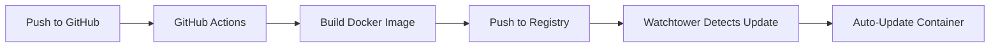

# 🚀 New Registry-Based Deployment Summary

## What Changed

**Before:** Complex SSH-based deployment with authentication issues  
**After:** Simple registry-based deployment using GitHub Container Registry

## How It Works Now



## Files Created/Modified

### ✅ New Files
- `.github/workflows/deploy-production.yml` - GitHub Actions workflow
- `deploy-registry.sh` - Simple deployment script
- `QNAP_CONTAINER_STATION_SETUP.md` - Comprehensive setup guide
- `DEPLOYMENT_SUMMARY.md` - This summary

### ✅ Modified Files
- `docker-compose.prod.yml` - Uses registry images + Watchtower
- `.env.prod` - Removed SSH configs, added GitHub repo
- `.env.prod.example` - Updated template

### ❌ Deprecated Files (can be deleted)
- `deploy-production.sh` - Complex SSH-based deployment
- `test-ssh.sh` - SSH connection testing
- `qnap-setup.sh` - SSH-based QNAP setup
- `INSTALL_SSHPASS.md` - No longer needed

## Quick Start

### 1. One-Time QNAP Setup
```bash
# Copy files to QNAP
scp docker-compose.prod.yml .env.prod admin@printmadenas.myqnapcloud.com:/share/printer-automater/

# Start containers
ssh admin@printmadenas.myqnapcloud.com
cd /share/printer-automater
docker-compose -f docker-compose.prod.yml up -d
```

### 2. Deploy New Code
```bash
# Simply push to GitHub - that's it!
git add .
git commit -m "Your changes"
git push

# Or use the helper script
./deploy-registry.sh
```

## Benefits

✅ **No SSH issues** - eliminates all authentication problems  
✅ **Automatic updates** - Watchtower pulls new images every 5 minutes  
✅ **Standard practice** - follows Docker/Kubernetes patterns  
✅ **Better security** - uses GitHub token authentication  
✅ **Easier rollbacks** - can pin to specific image versions  
✅ **Zero downtime** - rolling updates with health checks  

## Monitoring

- **GitHub Actions:** https://github.com/nandoserrano85/etsy_seller_automater/actions
- **Container Registry:** https://github.com/nandoserrano85/etsy_seller_automater/pkgs/container/printer-automater-backend
- **Health Check:** http://printmadenas.myqnapcloud.com:8080/health

## Next Steps

1. **Test the workflow:** Push this code to GitHub and verify GitHub Actions runs
2. **Set up QNAP:** Follow `QNAP_CONTAINER_STATION_SETUP.md`
3. **Monitor deployment:** Check GitHub Actions and container logs
4. **Clean up:** Delete old SSH-based deployment files

## Troubleshooting

If deployment fails:
1. Check GitHub Actions logs
2. Verify QNAP has internet access to pull images
3. Check container logs: `docker logs printer-automater-backend-prod`
4. Manual update: `docker-compose -f docker-compose.prod.yml pull && docker-compose -f docker-compose.prod.yml up -d`