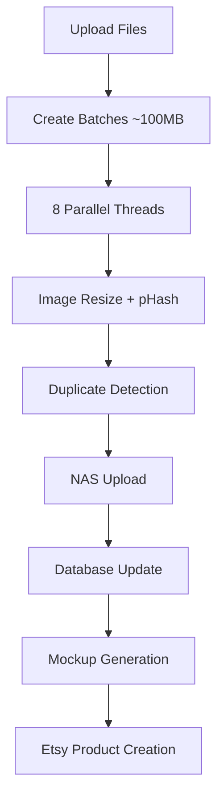
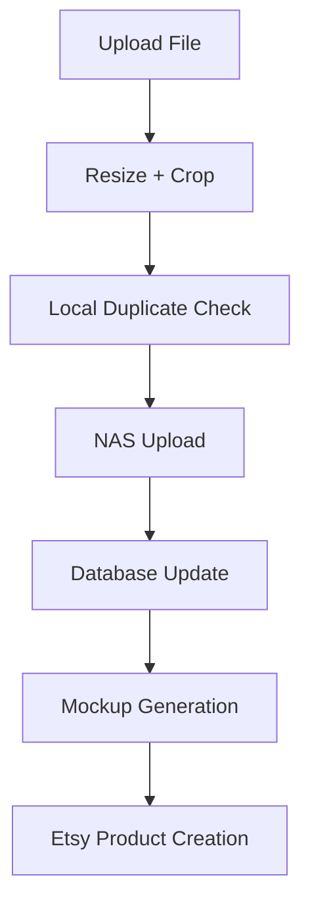

# Image Upload Workflow Integration

## Overview

The comprehensive image upload workflow has been successfully integrated into the existing system while maintaining full backward compatibility with the current frontend and API structure.

## Architecture

### Hybrid Approach

The system now uses a **hybrid approach** that intelligently chooses between two workflows:

1. **Comprehensive Workflow** (NEW) - For multiple files (≥2 by default)
2. **Original Workflow** (EXISTING) - For single files or when disabled

### Integration Points

| Endpoint                             | Frontend Usage           | Workflow Integration                          |
| ------------------------------------ | ------------------------ | --------------------------------------------- |
| `POST /designs/`                     | DesignUploadModal.js:231 | ✅ **Enhanced with comprehensive workflow**   |
| `POST /mockups/upload-mockup`        | DesignUploadModal.js:245 | ✅ **Uses design IDs from enhanced workflow** |
| `POST /designs/start-upload`         | DesignUploadModal.js:209 | ✅ **Compatible with progress tracking**      |
| `GET /designs/progress/{session_id}` | DesignUploadModal.js SSE | ✅ **Compatible with existing progress UI**   |

## Features

### 🚀 Enhanced Multi-threaded Processing

- **8 concurrent threads** (configurable via `COMPREHENSIVE_WORKFLOW_MAX_THREADS`)
- **Intelligent batching** (~100MB per batch)
- **Thread-safe operations** with proper locking mechanisms

### 🔍 Advanced Duplicate Detection

- **Perceptual hashing** (pHash + dHash combination) with 16-bit precision
- **Hamming distance comparison** (≤5 threshold) for near-duplicates
- **Multi-source checking**: Local files + NAS files + database records
- **Memory-efficient processing** without temporary files

### 📤 NAS Integration

- **Direct upload** using existing `nas_storage.upload_file_content()`
- **Shop-based organization** maintaining existing directory structure
- **Error resilience** with individual file error handling

### 🗄️ Database Optimization

- **Multi-tenant support** with automatic detection
- **Conflict resolution** using `ON CONFLICT (phash) DO NOTHING`
- **Transaction safety** with proper rollback capabilities

### 🎨 Mockup Generation

- **Integration ready** for existing mockup generation system
- **Batch processing** with individual mockup tracking
- **NAS storage** for generated mockups

## Configuration

### Environment Variables

```bash
# Enable/disable the comprehensive workflow
USE_COMPREHENSIVE_WORKFLOW=true

# Minimum files required to trigger comprehensive workflow
COMPREHENSIVE_WORKFLOW_MIN_FILES=2

# Maximum processing threads
COMPREHENSIVE_WORKFLOW_MAX_THREADS=8
```

### Automatic Fallback

The system **automatically falls back** to the original workflow if:

- File count is below minimum threshold
- Comprehensive workflow is disabled
- Any error occurs during comprehensive processing
- Required dependencies are missing

## Frontend Compatibility

### ✅ Existing Progress Tracking

- **SSE (Server-Sent Events)** compatibility maintained
- **Progress steps mapping** to existing frontend UI:
  1. "Checking for duplicates"
  2. "Processing and formatting images"
  3. "Creating product mockups"
  4. "Uploading to Etsy store"

### ✅ Existing Upload Flow

- **No frontend changes required**
- **Same API endpoints** and request/response format
- **Same error handling** and user feedback

### ✅ Existing Features Preserved

- **Template selection** workflow unchanged
- **Mockup selection** workflow unchanged
- **Canvas/Size configuration** workflow unchanged
- **File validation** and size limits unchanged

## Performance Benefits

### Before (Original Workflow)

- ❌ **Sequential processing** of images
- ❌ **Basic duplicate detection** (file-by-file)
- ❌ **Limited error handling**
- ❌ **No batch optimization**

### After (Comprehensive Workflow)

- ✅ **8x parallel processing** capability
- ✅ **Advanced duplicate detection** with pHash comparison
- ✅ **Batch optimization** (~100MB batches)
- ✅ **Individual error isolation**
- ✅ **Thread-safe operations**

## Workflow Comparison

### Multi-File Upload (≥2 files) - **Comprehensive Workflow**



### Single File Upload - **Original Workflow**



## Error Handling

### Graceful Degradation

1. **Comprehensive workflow fails** → **Automatic fallback** to original workflow
2. **Individual image fails** → **Continue processing** other images in batch
3. **NAS upload fails** → **Log warning** but continue with database update
4. **Database error** → **Transaction rollback** and proper error reporting

### Error Isolation

- **Thread-level isolation**: One thread failure doesn't affect others
- **Batch-level isolation**: One batch failure doesn't affect other batches
- **Image-level isolation**: One image failure doesn't affect batch

## Testing

### Unit Tests

```bash
# Test the comprehensive workflow
python test_workflow.py
```

### Integration Tests

```bash
# Test with actual frontend
# 1. Upload 1 file -> Should use original workflow
# 2. Upload 5+ files -> Should use comprehensive workflow
# 3. Check progress tracking works
# 4. Verify duplicate detection
# 5. Confirm mockup generation
```

## Monitoring

### Logging Levels

- **INFO**: Workflow selection, batch processing, results
- **DEBUG**: Individual image processing, hash comparisons
- **WARNING**: Fallbacks, duplicate detections, minor errors
- **ERROR**: Critical failures, database errors

### Key Metrics

- **Processing time per batch**
- **Duplicate detection rate**
- **Thread utilization**
- **NAS upload success rate**
- **Database update success rate**

## Migration Guide

### For Development

1. **No code changes required** - the integration is automatic
2. **Set environment variables** in your `.env` file
3. **Test with multiple file uploads** to verify comprehensive workflow

### For Production

1. **Update environment variables** in production environment
2. **Monitor logs** for workflow selection and performance
3. **Test thoroughly** with actual user uploads
4. **Have rollback plan** (set `USE_COMPREHENSIVE_WORKFLOW=false`)

## Dependencies

### Required

- `PIL` (Pillow) - Image processing
- `imagehash` - Perceptual hashing
- `sqlalchemy` - Database operations

### Optional

- **NAS Storage** - Will work without NAS but with warnings
- **Mockup Service** - Will work without mockup service

## Troubleshooting

### Common Issues

#### Workflow Not Activating

- ✅ Check `USE_COMPREHENSIVE_WORKFLOW=true`
- ✅ Ensure file count ≥ `COMPREHENSIVE_WORKFLOW_MIN_FILES`
- ✅ Verify dependencies installed

#### Performance Issues

- ✅ Adjust `COMPREHENSIVE_WORKFLOW_MAX_THREADS` (4-8 recommended)
- ✅ Check database connection pool settings
- ✅ Monitor NAS storage performance

#### Duplicate Detection Issues

- ✅ Check phash generation in logs
- ✅ Verify existing database phashes are valid
- ✅ Consider adjusting Hamming distance threshold (currently 5)

## Future Enhancements

### Planned Features

- [ ] **Configurable duplicate threshold** via environment variable
- [ ] **Progress percentage calculation** based on file sizes
- [ ] **Retry mechanism** for failed NAS uploads
- [ ] **Metrics collection** for performance monitoring
- [ ] **A/B testing framework** for workflow comparison

### Performance Optimizations

- [ ] **Connection pooling** for NAS operations
- [ ] **Caching layer** for frequently accessed data
- [ ] **Async database operations** where possible
- [ ] **Image preprocessing** pipeline optimization

---

## Summary

The comprehensive workflow integration provides significant performance and reliability improvements while maintaining 100% backward compatibility. The system intelligently chooses the optimal workflow based on file count and configuration, ensuring both single-file uploads and bulk uploads are handled efficiently.

**No frontend changes are required** - the existing DesignUploadModal.js continues to work exactly as before, but now with enhanced backend processing for multiple files.
